# Monospace Theme

> A cool, focused color system for code editors and terminals — characterized by a blue-gray base and a consistent purple accent.

Monospace is extracted and formalized from Google's IDX Monospace theme. It is characterized by a **cool blue-gray base** that recedes into the background and a **consistent purple accent** that carries every interactive element — buttons, cursors, focus rings, active tab borders, and links — across both flavors. The syntax palette uses muted greens for strings, soft blues for constants and functions, warm yellows for variables, and dusty pinks for keywords. Switching between dark and light feels like changing the lighting in a room, not changing themes.

## Color Palette

### Dark

<table>
    <tr>
        <th></th>
        <th>Labels</th>
        <th>Hex</th>
        <th>RGB</th>
        <th>HSL</th>
    </tr>
    <tr>
        <td></td>
        <td>Background</td>
        <td><code>#10151d</code></td>
        <td><code>rgb(16, 21, 29)</code></td>
        <td><code>hsl(217, 29%, 9%)</code></td>
    </tr>
    <tr>
        <td></td>
        <td>Surface</td>
        <td><code>#1f2939</code></td>
        <td><code>rgb(31, 41, 57)</code></td>
        <td><code>hsl(217, 30%, 17%)</code></td>
    </tr>
    <tr>
        <td></td>
        <td>Overlay</td>
        <td><code>#293444</code></td>
        <td><code>rgb(41, 52, 68)</code></td>
        <td><code>hsl(216, 25%, 21%)</code></td>
    </tr>
    <tr>
        <td></td>
        <td>Muted</td>
        <td><code>#333e4f</code></td>
        <td><code>rgb(51, 62, 79)</code></td>
        <td><code>hsl(216, 22%, 25%)</code></td>
    </tr>
    <tr>
        <td></td>
        <td>Subtle</td>
        <td><code>#3d495a</code></td>
        <td><code>rgb(61, 73, 90)</code></td>
        <td><code>hsl(215, 19%, 30%)</code></td>
    </tr>
    <tr>
        <td></td>
        <td>Foreground</td>
        <td><code>#d9dfe7</code></td>
        <td><code>rgb(217, 223, 231)</code></td>
        <td><code>hsl(214, 23%, 88%)</code></td>
    </tr>
    <tr>
        <td></td>
        <td>Muted Foreground</td>
        <td><code>#8b98a9</code></td>
        <td><code>rgb(139, 152, 169)</code></td>
        <td><code>hsl(214, 15%, 60%)</code></td>
    </tr>
    <tr>
        <td></td>
        <td>Purple</td>
        <td><code>#a87ffb</code></td>
        <td><code>rgb(168, 127, 251)</code></td>
        <td><code>hsl(260, 94%, 74%)</code></td>
    </tr>
    <tr>
        <td>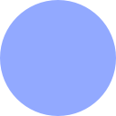</td>
        <td>Blue</td>
        <td><code>#92a9ff</code></td>
        <td><code>rgb(146, 169, 255)</code></td>
        <td><code>hsl(227, 100%, 79%)</code></td>
    </tr>
    <tr>
        <td>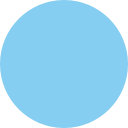</td>
        <td>Cyan</td>
        <td><code>#85cdf1</code></td>
        <td><code>rgb(133, 205, 241)</code></td>
        <td><code>hsl(200, 79%, 73%)</code></td>
    </tr>
    <tr>
        <td></td>
        <td>Green</td>
        <td><code>#77d5a3</code></td>
        <td><code>rgb(119, 213, 163)</code></td>
        <td><code>hsl(148, 53%, 65%)</code></td>
    </tr>
    <tr>
        <td>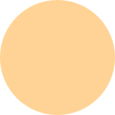</td>
        <td>Yellow</td>
        <td><code>#ffd395</code></td>
        <td><code>rgb(255, 211, 149)</code></td>
        <td><code>hsl(35, 100%, 79%)</code></td>
    </tr>
    <tr>
        <td>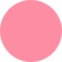</td>
        <td>Pink</td>
        <td><code>#fd8da3</code></td>
        <td><code>rgb(253, 141, 163)</code></td>
        <td><code>hsl(348, 97%, 77%)</code></td>
    </tr>
    <tr>
        <td></td>
        <td>Red</td>
        <td><code>#f76769</code></td>
        <td><code>rgb(247, 103, 105)</code></td>
        <td><code>hsl(359, 90%, 69%)</code></td>
    </tr>
    <tr>
        <td></td>
        <td>Mauve</td>
        <td><code>#bd9cfe</code></td>
        <td><code>rgb(189, 156, 254)</code></td>
        <td><code>hsl(260, 98%, 80%)</code></td>
    </tr>
</table>

### Light

<table>
    <tr>
        <th></th>
        <th>Labels</th>
        <th>Hex</th>
        <th>RGB</th>
        <th>HSL</th>
    </tr>
    <tr>
        <td>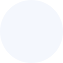</td>
        <td>Background</td>
        <td><code>#f4f7fd</code></td>
        <td><code>rgb(244, 247, 253)</code></td>
        <td><code>hsl(220, 69%, 97%)</code></td>
    </tr>
    <tr>
        <td>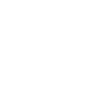</td>
        <td>Surface</td>
        <td><code>#ffffff</code></td>
        <td><code>rgb(255, 255, 255)</code></td>
        <td><code>hsl(0, 0%, 100%)</code></td>
    </tr>
    <tr>
        <td></td>
        <td>Overlay</td>
        <td><code>#e7ebf2</code></td>
        <td><code>rgb(231, 235, 242)</code></td>
        <td><code>hsl(218, 30%, 93%)</code></td>
    </tr>
    <tr>
        <td></td>
        <td>Muted</td>
        <td><code>#d9dfe7</code></td>
        <td><code>rgb(217, 223, 231)</code></td>
        <td><code>hsl(214, 23%, 88%)</code></td>
    </tr>
    <tr>
        <td>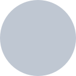</td>
        <td>Subtle</td>
        <td><code>#bfc7d2</code></td>
        <td><code>rgb(191, 199, 210)</code></td>
        <td><code>hsl(215, 17%, 79%)</code></td>
    </tr>
    <tr>
        <td></td>
        <td>Foreground</td>
        <td><code>#1f2939</code></td>
        <td><code>rgb(31, 41, 57)</code></td>
        <td><code>hsl(217, 30%, 17%)</code></td>
    </tr>
    <tr>
        <td></td>
        <td>Muted Foreground</td>
        <td><code>#738295</code></td>
        <td><code>rgb(115, 130, 149)</code></td>
        <td><code>hsl(214, 14%, 52%)</code></td>
    </tr>
    <tr>
        <td></td>
        <td>Purple</td>
        <td><code>#6f4cde</code></td>
        <td><code>rgb(111, 76, 222)</code></td>
        <td><code>hsl(254, 69%, 58%)</code></td>
    </tr>
    <tr>
        <td></td>
        <td>Blue</td>
        <td><code>#264dcb</code></td>
        <td><code>rgb(38, 77, 203)</code></td>
        <td><code>hsl(226, 68%, 47%)</code></td>
    </tr>
    <tr>
        <td></td>
        <td>Cyan</td>
        <td><code>#0075a2</code></td>
        <td><code>rgb(0, 117, 162)</code></td>
        <td><code>hsl(197, 100%, 32%)</code></td>
    </tr>
    <tr>
        <td></td>
        <td>Green</td>
        <td><code>#007b49</code></td>
        <td><code>rgb(0, 123, 73)</code></td>
        <td><code>hsl(156, 100%, 24%)</code></td>
    </tr>
    <tr>
        <td></td>
        <td>Yellow</td>
        <td><code>#d07826</code></td>
        <td><code>rgb(208, 120, 38)</code></td>
        <td><code>hsl(29, 69%, 48%)</code></td>
    </tr>
    <tr>
        <td></td>
        <td>Pink</td>
        <td><code>#c43058</code></td>
        <td><code>rgb(196, 48, 88)</code></td>
        <td><code>hsl(344, 61%, 48%)</code></td>
    </tr>
    <tr>
        <td></td>
        <td>Red</td>
        <td><code>#df4047</code></td>
        <td><code>rgb(223, 64, 71)</code></td>
        <td><code>hsl(357, 71%, 56%)</code></td>
    </tr>
    <tr>
        <td></td>
        <td>Mauve</td>
        <td><code>#6f4cde</code></td>
        <td><code>rgb(111, 76, 222)</code></td>
        <td><code>hsl(254, 69%, 58%)</code></td>
    </tr>
</table>

For details on how these colors map to syntax tokens, see the [Syntax Roles](#syntax-roles) section below.

---

## Base16 Terminal Colors

### Dark

<table>
    <tr>
        <th></th>
        <th>Token</th>
        <th>Hex</th>
        <th>RGB</th>
    </tr>
    <tr>
        <td></td>
        <td>Black</td>
        <td><code>#738295</code></td>
        <td><code>rgb(115, 130, 149)</code></td>
    </tr>
    <tr>
        <td></td>
        <td>Red</td>
        <td><code>#f76769</code></td>
        <td><code>rgb(247, 103, 105)</code></td>
    </tr>
    <tr>
        <td></td>
        <td>Green</td>
        <td><code>#17b877</code></td>
        <td><code>rgb(23, 184, 119)</code></td>
    </tr>
    <tr>
        <td></td>
        <td>Yellow</td>
        <td><code>#ffa23e</code></td>
        <td><code>rgb(255, 162, 62)</code></td>
    </tr>
    <tr>
        <td>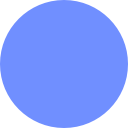</td>
        <td>Blue</td>
        <td><code>#708fff</code></td>
        <td><code>rgb(112, 143, 255)</code></td>
    </tr>
    <tr>
        <td>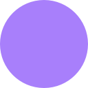</td>
        <td>Magenta</td>
        <td><code>#a87ffb</code></td>
        <td><code>rgb(168, 127, 251)</code></td>
    </tr>
    <tr>
        <td></td>
        <td>Cyan</td>
        <td><code>#25a6e9</code></td>
        <td><code>rgb(37, 166, 233)</code></td>
    </tr>
    <tr>
        <td></td>
        <td>White</td>
        <td><code>#a4afbd</code></td>
        <td><code>rgb(164, 175, 189)</code></td>
    </tr>
    <tr>
        <td>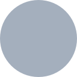</td>
        <td>Bright Black</td>
        <td><code>#8b98a9</code></td>
        <td><code>rgb(139, 152, 169)</code></td>
    </tr>
    <tr>
        <td>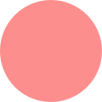</td>
        <td>Bright Red</td>
        <td><code>#fc8f8e</code></td>
        <td><code>rgb(252, 143, 142)</code></td>
    </tr>
    <tr>
        <td>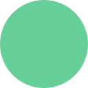</td>
        <td>Bright Green</td>
        <td><code>#66ce98</code></td>
        <td><code>rgb(102, 206, 152)</code></td>
    </tr>
    <tr>
        <td></td>
        <td>Bright Yellow</td>
        <td><code>#ffc26e</code></td>
        <td><code>rgb(255, 194, 110)</code></td>
    </tr>
    <tr>
        <td>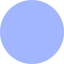</td>
        <td>Bright Blue</td>
        <td><code>#a2b6ff</code></td>
        <td><code>rgb(162, 182, 255)</code></td>
    </tr>
    <tr>
        <td>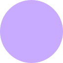</td>
        <td>Bright Magenta</td>
        <td><code>#c8aaff</code></td>
        <td><code>rgb(200, 170, 255)</code></td>
    </tr>
    <tr>
        <td>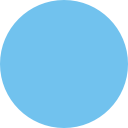</td>
        <td>Bright Cyan</td>
        <td><code>#71c2ee</code></td>
        <td><code>rgb(113, 194, 238)</code></td>
    </tr>
    <tr>
        <td></td>
        <td>Bright White</td>
        <td><code>#fafbfe</code></td>
        <td><code>rgb(250, 251, 254)</code></td>
    </tr>
</table>

### Light

<table>
    <tr>
        <th></th>
        <th>Token</th>
        <th>Hex</th>
        <th>RGB</th>
    </tr>
    <tr>
        <td></td>
        <td>Black</td>
        <td><code>#333e4f</code></td>
        <td><code>rgb(51, 62, 79)</code></td>
    </tr>
    <tr>
        <td></td>
        <td>Red</td>
        <td><code>#d03941</code></td>
        <td><code>rgb(208, 57, 65)</code></td>
    </tr>
    <tr>
        <td></td>
        <td>Green</td>
        <td><code>#007b49</code></td>
        <td><code>rgb(0, 123, 73)</code></td>
    </tr>
    <tr>
        <td></td>
        <td>Yellow</td>
        <td><code>#a65921</code></td>
        <td><code>rgb(166, 89, 33)</code></td>
    </tr>
    <tr>
        <td></td>
        <td>Blue</td>
        <td><code>#3c60dd</code></td>
        <td><code>rgb(60, 96, 221)</code></td>
    </tr>
    <tr>
        <td>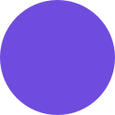</td>
        <td>Magenta</td>
        <td><code>#6f4cde</code></td>
        <td><code>rgb(111, 76, 222)</code></td>
    </tr>
    <tr>
        <td></td>
        <td>Cyan</td>
        <td><code>#0075a2</code></td>
        <td><code>rgb(0, 117, 162)</code></td>
    </tr>
    <tr>
        <td></td>
        <td>White</td>
        <td><code>#5d6a7d</code></td>
        <td><code>rgb(93, 106, 125)</code></td>
    </tr>
    <tr>
        <td></td>
        <td>Bright Black</td>
        <td><code>#000000</code></td>
        <td><code>rgb(0, 0, 0)</code></td>
    </tr>
    <tr>
        <td></td>
        <td>Bright Red</td>
        <td><code>#a52430</code></td>
        <td><code>rgb(165, 36, 48)</code></td>
    </tr>
    <tr>
        <td></td>
        <td>Bright Green</td>
        <td><code>#00522f</code></td>
        <td><code>rgb(0, 82, 47)</code></td>
    </tr>
    <tr>
        <td></td>
        <td>Bright Yellow</td>
        <td><code>#904b1a</code></td>
        <td><code>rgb(144, 75, 26)</code></td>
    </tr>
    <tr>
        <td></td>
        <td>Bright Blue</td>
        <td><code>#002487</code></td>
        <td><code>rgb(0, 36, 135)</code></td>
    </tr>
    <tr>
        <td>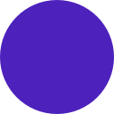</td>
        <td>Bright Magenta</td>
        <td><code>#4d21bb</code></td>
        <td><code>rgb(77, 33, 187)</code></td>
    </tr>
    <tr>
        <td></td>
        <td>Bright Cyan</td>
        <td><code>#00607e</code></td>
        <td><code>rgb(0, 96, 126)</code></td>
    </tr>
    <tr>
        <td></td>
        <td>Bright White</td>
        <td><code>#475365</code></td>
        <td><code>rgb(71, 83, 101)</code></td>
    </tr>
</table>

---

## iTerm2 UI Colors

| Token                       | Dark        | Light     |
| --------------------------- | ----------- | --------- |
| `{{ Background_Color }}`    | `#10151d`   | `#f4f7fd` |
| `{{ Foreground_Color }}`    | `#a4afbd`   | `#475365` |
| `{{ Bold_Color }}`          | `#d9dfe7`   | `#1f2939` |
| `{{ Cursor_Color }}`        | `#c8aaff`   | `#6f4cde` |
| `{{ Cursor_Text_Color }}`   | `#10151d`   | `#f4f7fd` |
| `{{ Selection_Color }}`     | `#264dcb80` | `#c7d3ff` |
| `{{ Selected_Text_Color }}` | `#d9dfe7`   | `#1f2939` |

---

## Syntax Roles

How the palette colors map to code tokens across both flavors.

| Role                    | Dark                 | Light            | Used for                                  |
| ----------------------- | -------------------- | ---------------- | ----------------------------------------- |
| Keywords / Storage      | Pink `#fd8da3`       | Pink `#c43058`   | `if`, `const`, `function`, `class`        |
| Strings                 | Green `#77d5a3`      | Green `#007b49`  | String literals, template literals, regex |
| Constants / Support     | Blue `#92a9ff`       | Blue `#264dcb`   | Numeric constants, built-in support       |
| Variables               | Yellow `#ffd395`     | Yellow `#d07826` | Variable names, parameters                |
| Functions / Classes     | Blue `#92a9ff`       | Blue `#264dcb`   | Function names, class names               |
| Properties / HTML attrs | Cyan `#85cdf1`       | Cyan `#0075a2`   | Object keys, HTML/XML attributes          |
| Tags                    | Green `#77d5a3`      | Green `#007b49`  | HTML/JSX tags                             |
| Types / Entities        | Mauve `#bd9cfe`      | Mauve `#6f4cde`  | Type names, entity names                  |
| Comments                | `#7f8d9f`            | `#637083`        | Inline and block comments                 |
| Errors / Invalid        | Pink Light `#ffc6d0` | Red `#ad1c48`    | Invalid tokens, errors                    |

---

## Ports

### Dark

| Application      | File                                                                                                   |
| ---------------- | ------------------------------------------------------------------------------------------------------ |
| Alacritty        | [`monospace-dark.alacritty.toml`](themes/alacritty/monospace_dark.alacritty.toml)                      |
| Windows Terminal | [`monospace-dark.windows-terminal.json`](themes/windows-terminal/monospace_dark.windows-terminal.json) |
| Warp             | [`monospace_dark.warp.yaml`](themes/warp/monospace_dark.warp.yaml)                                     |

### Light

| Application      | File                                                                                                     |
| ---------------- | -------------------------------------------------------------------------------------------------------- |
| Alacritty        | [`monospace-light.alacritty.toml`](themes/alacritty/monospace_light.alacritty.toml)                      |
| Windows Terminal | [`monospace-light.windows-terminal.json`](themes/windows-terminal/monospace_light.windows-terminal.json) |
| Warp             | [`monospace_light.warp.yaml`](themes/warp/monospace_light.warp.yaml)                                     |

---

## License

[MIT License](./LICENSE)
